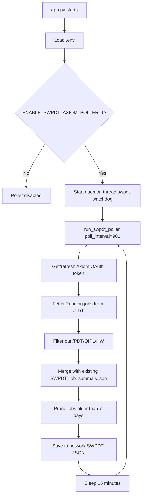
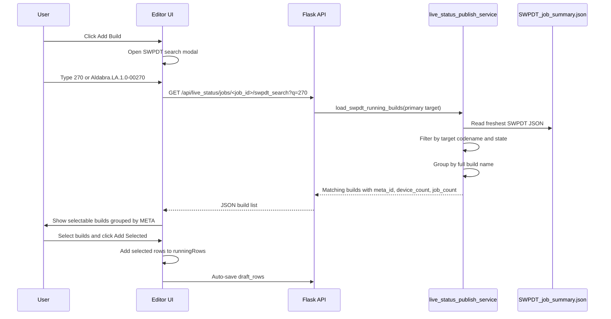
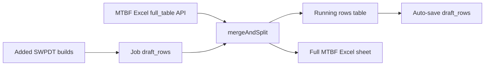
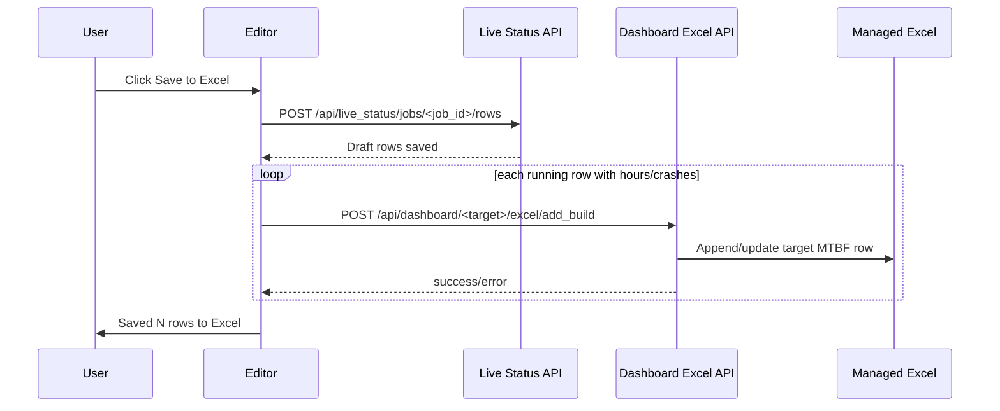
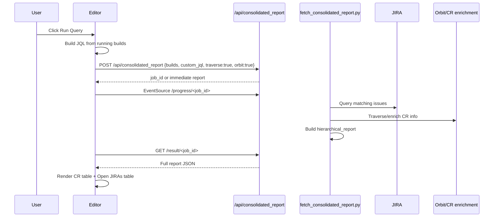
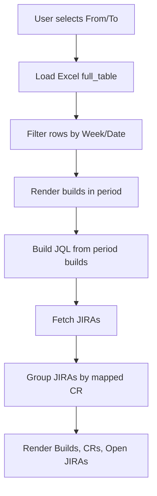
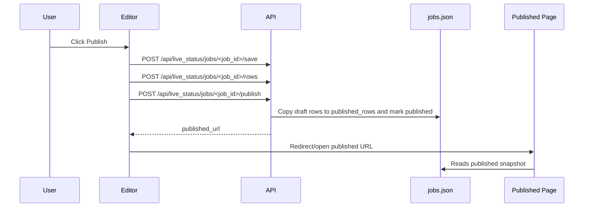

# Live Status Publish — Technical Documentation

This document is the detailed implementation/operation guide for the PDTBuddy **Live Status Publish** module. It explains how the editor page, SWPDT/Axiom polling, Add Build flow, JIRA/CR report flow, MTBF calculation, Excel sync, and published view work together.

Related planning/spec file:

```text docs/live_status_publish_technical_doc.md
./docs/live_status_publish_plan.md
```

---

## 1. Purpose

Live Status Publish lets TARGET_GROUP users create a controlled live status page for a target. The editor can pull running builds from SWPDT/Axiom, allow users to add/edit builds, enter hours/crashes/comments, run CR/JIRA reports, view MTBF trends, save to Excel, and publish a read-only snapshot.

Important rule:

> The editor uses draft data. The public/published page should only show data that has been intentionally published.

---

## 2. Main Files

| Area | File | Purpose |
|---|---|---|
| Routes | `live_status_publish_routes.py` | Flask routes for landing, editor, published page, SWPDT status/search/force-refresh, save/publish APIs |
| Service | `live_status_publish_service.py` | Reads jobs JSON, MTBF Excel rows, SWPDT JSON, merges Excel + draft + SWPDT rows |
| Editor HTML | `templates/live_status_publish_edit.html` | Editor UI: Current Report, MTBF Trend, Weekly Report tabs |
| Published HTML | `templates/live_status_publish_published.html` | Read-only published report page |
| Editor JS | `static/js/lsp_v2.js` | Add Build, refresh rows, auto-save, JIRA/CR report, SWPDT status, Excel save |
| SWPDT Poller | `scripts/fetch_axiom_jobs.py` | Fetches running Axiom jobs and writes `SWPDT_job_summary.json` |
| Consolidated Report | `scripts/fetch_consolidated_report.py` | JIRA + CR/Orbit traversal/report pipeline |
| JIRA Build Lookup | `scripts/fetch_jira_by_build.py` | Lower-level JIRA query helper used by older API |
| Existing Dashboard APIs | `dashboard_routes.py` | `/api/consolidated_report`, Excel full table/add build APIs |
| Plan/Spec | `docs/live_status_publish_plan.md` | Original feature spec and acceptance criteria |

---

## 3. Runtime Architecture



Current expected environment flag:

```text docs/live_status_publish_technical_doc.md
ENABLE_SWPDT_AXIOM_POLLER=1
```

Axiom credentials must also be configured:

```text docs/live_status_publish_technical_doc.md
AXIOM_API_HOST=api-int.qualcomm.com
AXIOM_CLIENT_ID=<configured>
AXIOM_CLIENT_SECRET=<configured>
AXIOM_TAXONOMY_PATH_SW=/PDT
AXIOM_TAXONOMY_PATH_HW=/PDT/QIPL/HW
```

---

## 4. SWPDT/Axiom Polling Details

### 4.1 What starts the background polling?

`app.py` checks this flag during startup:

```text docs/live_status_publish_technical_doc.md
ENABLE_SWPDT_AXIOM_POLLER=1
```

If enabled, it starts a daemon watchdog thread named:

```text docs/live_status_publish_technical_doc.md
swpdt-watchdog
```

That watchdog calls:

```text docs/live_status_publish_technical_doc.md
run_swpdt_poller(poll_interval=900)
```

`900` seconds = **15 minutes**.

### 4.2 What does the poller fetch?

The poller uses Axiom public jobs API under SWPDT taxonomy:

```text docs/live_status_publish_technical_doc.md
/axiom/v1/public/jobs?taxonomyPath=/PDT&submittedFrom=<today 00:00 UTC>&state=Running&pageNumber=<n>&pageSize=<size>&expand=chipIdSerialNumbers
```

It excludes HWPDT jobs whose taxonomy begins with:

```text docs/live_status_publish_technical_doc.md
/PDT/QIPL/HW
```

### 4.3 What JSON is written?

Primary network output:

```text docs/live_status_publish_technical_doc.md
\\sphere\pdtqipl_internal\PDTBuddy\SWPDT\SWPDT_job_summary.json
```

Payload shape:

```json docs/live_status_publish_technical_doc.md
{
  "generated_at": "2026-05-20T02:23:47Z",
  "taxonomy": "/PDT",
  "hwpdt_excluded": "/PDT/QIPL/HW",
  "retention_days": 7,
  "total_jobs": 1416,
  "total_devices": 1234,
  "state_counts": {
    "Running": 622,
    "Submitted": 99,
    "Dispatched": 5,
    "Completed": 367,
    "Aborted": 323
  },
  "jobs": [
    {
      "job_id": "...",
      "software_product": "Aldabra.LA.1.0",
      "build": "\\\\server\\path\\Aldabra.LA.1.0-00270-STD.INT-1",
      "submitter": "...",
      "state": "Running",
      "submitted": "2026-05-20T01:00:00Z",
      "started": "2026-05-20T01:05:00Z",
      "ended": null,
      "device_count": 74,
      "chip_ids": ["..."]
    }
  ]
}
```

### 4.4 Freshest file selection

`live_status_publish_service.py` uses a helper that chooses the freshest available SWPDT JSON:

1. Network file exists and is newer → use network.
2. Local backup exists and is newer → use local.
3. Only one exists → use that one.
4. Neither exists → default to network path and return empty rows safely.

This avoids getting stuck on stale local data if the network path becomes available later.

---

## 5. SWPDT Status and Force Refresh

### 5.1 Status API

```text docs/live_status_publish_technical_doc.md
GET /api/live_status/swpdt_status
```

Returns:

```json docs/live_status_publish_technical_doc.md
{
  "ok": true,
  "status": {
    "file_exists": true,
    "file_age_min": 3.2,
    "generated_at": "2026-05-20T02:23:47Z",
    "total_jobs": 1416,
    "state_counts": {"Running": 622},
    "poller_thread": "swpdt-watchdog",
    "poller_alive": true,
    "active_path": "\\\\sphere\\pdtqipl_internal\\PDTBuddy\\SWPDT\\SWPDT_job_summary.json",
    "using_network": true,
    "network_exists": true,
    "local_exists": true
  }
}
```

Editor chip interpretation:

| UI State | Meaning |
|---|---|
| `2m ago | 622 running | 1416 total | polling` | Healthy |
| `45m ago | ... | polling` | Data getting old but thread alive |
| `360m ago | ... | POLLER OFF` | Poller disabled/dead or server restarted without flag |
| Local drive icon | Using local backup instead of network file |
| Network icon | Using network SWPDT file |

### 5.2 Force Refresh API

```text docs/live_status_publish_technical_doc.md
POST /api/live_status/swpdt_force_refresh
```

This does a one-shot Axiom fetch immediately, merges/prunes the JSON, writes `SWPDT_job_summary.json`, then the editor reloads rows.

Use when:

- SWPDT JSON is stale.
- Poller is off.
- User needs current Axiom data immediately.
- Testing the Axiom path.

---

## 6. Add Build Flow



### 6.1 Search endpoint

```text docs/live_status_publish_technical_doc.md
GET /api/live_status/jobs/<job_id>/swpdt_search?q=<query>
```

Matches:

- Full build name contains query.
- `META-00270` contains query.
- Meta number `270` matches `META-00270`.

### 6.2 Target matching

For target `Aldabra`, SWPDT jobs use software product like:

```text docs/live_status_publish_technical_doc.md
Aldabra.LA.1.0
```

Matching uses codename logic:

```text docs/live_status_publish_technical_doc.md
aldabra == aldabra.la.1.0.split('.')[0]
```

### 6.3 State handling

These SWPDT states are treated as active/running in the editor:

| Axiom State | Editor Run Status |
|---|---|
| `Running` | `running` |
| `Submitted` | `running` |
| `Dispatched` | `running` |
| `Completed` | completed/stopped candidate |

---

## 7. Draft Rows, Excel Rows, and Merge Logic

The editor loads two major data sources:

1. MTBF Excel rows from managed Excel.
2. Draft rows saved inside the live-status job JSON store.

Then it merges them.



### 7.1 Row key

Rows are matched by:

```text docs/live_status_publish_technical_doc.md
build_full.upper() first, fallback to meta_id.upper()
```

### 7.2 Draft override behavior

If a draft row matches an Excel row, draft values override selected fields:

```text docs/live_status_publish_technical_doc.md
run_status, hours, crashes, mtbf, comments, week, job_count, device_count, test_eng_comment
```

If a draft row does not match Excel, it is shown as JSON/SWPDT-only.

---

## 8. Editor Page Tabs

Current editor page has three tabs:

| Tab | Purpose |
|---|---|
| Current Report | Running builds table + JIRA/CR query/report |
| MTBF Trend | MTBF chart for current running builds |
| Weekly Report | Date-range based builds + CRs + open JIRAs |

---

## 9. Current Report Tab

### 9.1 Running builds table

Columns:

```text docs/live_status_publish_technical_doc.md
Week | Meta | Full Build | Hours | Crashes | MTBF | Jobs | Devices | Test Eng Comment | Source
```

User can edit:

- Hours
- Crashes
- MTBF
- Test Eng Comment

When hours/crashes change:

```text docs/live_status_publish_technical_doc.md
if hours > 0 and crashes > 0:
    mtbf = hours / crashes
```

The draft auto-saves after edits.

### 9.2 Merge suggestions

If multiple running builds share the same `META-xxxxx`, editor shows a merge suggestion. Merging:

- Keeps one row per meta.
- Stores all builds in `merged_builds`.
- Sums device counts.
- Sums job counts.
- Uses earliest week/first submitted date.

---

## 10. Hours and MTBF Calculation

### 10.1 Current simple MTBF formula

In current editor implementation:

```text docs/live_status_publish_technical_doc.md
MTBF = hours / crashes
```

Only calculated when both values are positive.

### 10.2 MTBF trend chart

The MTBF Trend tab reads `window.lspRunningRows` and renders:

- Bar: tested hours
- Bar: crashes
- Line: MTBF

Summary pills:

```text docs/live_status_publish_technical_doc.md
Total hours | Total crashes | Average MTBF
```

Average MTBF:

```text docs/live_status_publish_technical_doc.md
avg_mtbf = total_hours / total_crashes
```

If no crashes or no hours, average MTBF shows `—`.

---

## 11. Save to Excel Flow



Excel add payload includes:

```json docs/live_status_publish_technical_doc.md
{
  "target": "Aldabra",
  "product": "",
  "build": "META-00270",
  "build_full": "Aldabra.LA.1.0-00270-STD.INT-1",
  "hours": "100",
  "crashes": "5",
  "mtbf": "20",
  "week": "2026-05-20",
  "run_status": "running",
  "build_status": "running",
  "mtbf_details": "Test Eng note"
}
```

---

## 12. JIRA / CR Report Flow

Earlier implementation only opened the JIRA URL. The correct/current intended behavior is to use the same consolidated-report pipeline as the existing Live Status Studio.



### 12.1 JQL construction

For running builds:

```text docs/live_status_publish_technical_doc.md
(summary ~ "BuildA" OR summary ~ "BuildB" OR summary ~ "BuildC") and summary !~ "tombstone"
```

Merged rows expand to all `merged_builds`.

### 12.2 Consolidated report request

```json docs/live_status_publish_technical_doc.md
{
  "builds": ["Aldabra.LA.1.0-00270-STD.INT-1"],
  "traverse": true,
  "orbit": true,
  "target": "Aldabra",
  "force": false,
  "custom_jql": "(summary ~ \"...\") and summary !~ \"tombstone\""
}
```

### 12.3 Report output shape

`/api/consolidated_report/result/<job_id>` returns a report with:

```json docs/live_status_publish_technical_doc.md
{
  "meta": {
    "build_ids": ["..."],
    "jql": "...",
    "fetch_time_sec": 12.4
  },
  "summary": {
    "total_jiras": 10,
    "total_crs": 3
  },
  "hierarchical_report": [
    {
      "cr": "CR1234567",
      "cr_title": "Title",
      "cr_status": "Open",
      "cr_date": "2026-05-01",
      "cr_area": "Area",
      "cr_subsystem": "Subsystem",
      "jiras": [
        {"key": "ABC-123", "summary": "...", "status": "Open"}
      ]
    },
    {
      "cr": "NO_CR",
      "jiras": [
        {"key": "ABC-999", "summary": "Unmapped", "status": "Open"}
      ]
    }
  ]
}
```

### 12.4 Editor rendering

The editor should render:

1. Summary pills: CR count, JIRA count, unmapped count.
2. CR table: CR, title, JIRA count, area, subsystem, status, age.
3. Expandable child JIRAs per CR.
4. Open JIRAs without CR in separate table.

---

## 13. Weekly Report Tab

Weekly report flow:



Current implementation uses Excel rows as the build source for the period, then fetches JIRA data using a build/JQL lookup.

---

## 14. Publish Flow



Published route:

```text docs/live_status_publish_technical_doc.md
/published/live-status/<public_token>
```

Viewer should not directly read unreviewed SWPDT JSON. It should use published job data.

---

## 15. Important APIs

| API | Method | Purpose |
|---|---|---|
| `/live_status_view` | GET | Landing page |
| `/live_status_view/target/<target_name>` | GET | Open/create target workspace |
| `/live_status_view/<job_id>/edit` | GET | Editor page |
| `/published/live-status/<public_token>` | GET | Published view |
| `/api/live_status/jobs/<job_id>/workspace` | GET | Load merged workspace data |
| `/api/live_status/jobs/<job_id>/rows` | POST | Save draft rows |
| `/api/live_status/jobs/<job_id>/publish` | POST | Publish snapshot |
| `/api/live_status/jobs/<job_id>/swpdt_search` | GET | Search SWPDT builds |
| `/api/live_status/jobs/<job_id>/swpdt` | GET | Return SWPDT builds for target |
| `/api/live_status/swpdt_status` | GET | SWPDT file/thread status |
| `/api/live_status/swpdt_force_refresh` | POST | Immediate Axiom fetch |
| `/api/consolidated_report` | POST | Run CR/JIRA consolidated pipeline |
| `/api/consolidated_report/progress/<job_id>` | GET/SSE | Progress stream |
| `/api/consolidated_report/result/<job_id>` | GET | Final report |
| `/api/dashboard/<target>/excel/full_table` | GET | Read MTBF Excel rows |
| `/api/dashboard/<target>/excel/add_build` | POST | Save row to MTBF Excel |

---

## 16. Data Store Model Currently Used

Current lightweight implementation stores jobs in JSON rather than DB tables:

```text docs/live_status_publish_technical_doc.md
\\sphere\pdtqipl_internal\PDTBuddy\live_status_publish\jobs.json
```

Each job contains:

```json docs/live_status_publish_technical_doc.md
{
  "id": "uuid",
  "name": "Aldabra Live Status",
  "targets": ["Aldabra"],
  "status": "draft|published",
  "public_token": "...",
  "draft_rows": [],
  "published_rows": [],
  "published_comments_draft": "",
  "published_comments_snapshot": ""
}
```

---

## 17. Operational Checks

### 17.1 Check if poller is enabled

```powershell docs/live_status_publish_technical_doc.md
Get-Content .\.env | Select-String "ENABLE_SWPDT_AXIOM_POLLER"
```

Expected:

```text docs/live_status_publish_technical_doc.md
ENABLE_SWPDT_AXIOM_POLLER=1
```

### 17.2 Check SWPDT JSON age

```powershell docs/live_status_publish_technical_doc.md
$json = Get-Content "\\sphere\pdtqipl_internal\PDTBuddy\SWPDT\SWPDT_job_summary.json" -Raw | ConvertFrom-Json
$json.generated_at
$json.total_jobs
$json.state_counts
```

### 17.3 Check target rows from service

```powershell docs/live_status_publish_technical_doc.md
.\venv\Scripts\python.exe -c "from live_status_publish_service import load_swpdt_running_builds; rows=load_swpdt_running_builds('Aldabra'); print(len(rows)); print(rows[:3])"
```

---

## 18. Failure Handling

| Failure | Behavior |
|---|---|
| Network SWPDT path unavailable | Fall back to local JSON if available |
| Axiom credentials missing | Poller/force-refresh returns config error |
| Axiom API returns no jobs | Existing JSON is preserved; UI can show stale warning |
| Poller dies | Watchdog restarts it after 60 seconds if app thread is alive |
| JSON stale | UI chip warns; user can Force Refresh |
| Excel unavailable | Editor should keep draft data and show save error |
| JIRA/consolidated report fails | Result panel shows error; running builds remain unchanged |
| Published page opened before publish | Redirect/not found depending route behavior |

---

## 19. Known Design Rules

1. Do not auto-publish SWPDT/Axiom builds.
2. Editor draft rows are separate from published rows.
3. Removed/disabled builds should not affect report/MTBF calculations.
4. Hidden viewer fields should be filtered server-side in the final implementation.
5. Raw JIRA results should not be hard-deleted; exclusions should be applied as effective filters.
6. Excel writes should be backend-only and should not be triggered by viewer actions.
7. Poller should fetch every 15 minutes; manual Force Refresh is available for immediate data.

---

## 20. Future Improvements

- Move job/draft/published storage from JSON to DB tables.
- Add audit log for build added/removed, query run, publish, Excel save.
- Add row-level JIRA exclusion rules.
- Add restore removed build.
- Add server-side published API field filtering.
- Add background scheduled JIRA/CR refresh for active published queries.
- Add Excel file lock/backup before writes.
- Add admin page showing SWPDT poller logs and last successful run.
